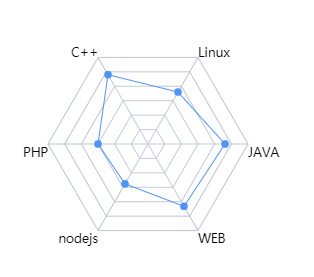

  
# 文洲的简历
 <table class="table" border="1" style="background-color:red;height:100px;border:1px soild red">
      <tr><td>1</td><td style="width:500px;color:yellow;font-size:30px">2</td></tr>
      <tr><td>1</td><td></td></tr>
 </table>

  

<html>
    <head>
        <link rel="stylesheet" href="src/css/css.css">
        <link rel="stylesheet" href="src/css/left.css">        
        <title>文洲的简历</title>
    </head>
    <body>
        

            

                

                    
                

                

                    文 洲
                      
12

                

                

                    电话:130-4362-9968
                    地址:西安未央区凤城五路
                    微信:wzskyline
                    github:github.com/wzskyline
                

                

                        
                

                

                    
                
    
            

            

                <h1 class="first">简介</h1>
                <h1 class="project">项目</h1>
                <h1 class="words">寄语</h1>
                感谢您花时间阅读我的简历

                
            

        
  

        
    </body>
</html>

# update log
<pre> 
2019-06-09:初始化

</pre>
